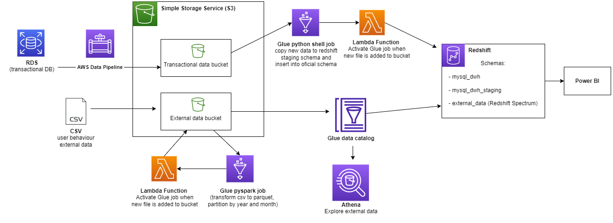
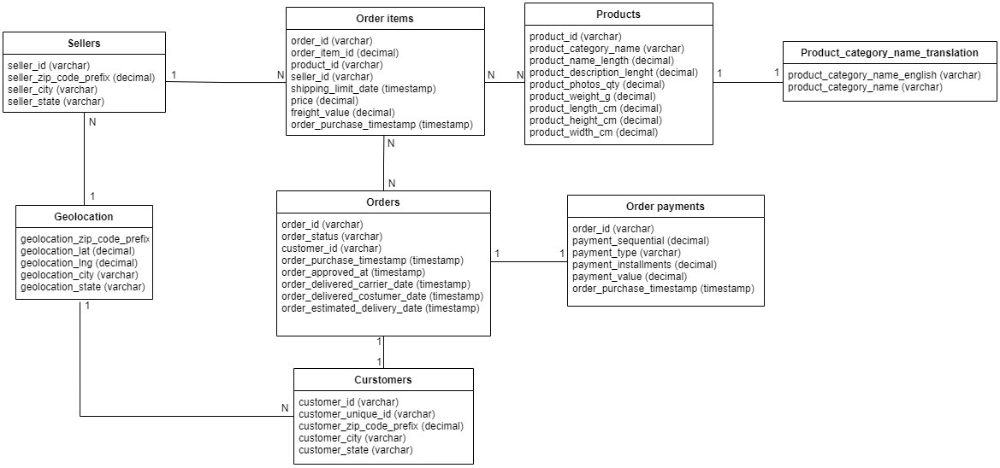

# Data Engineering, Serverless ETL and BI

## Data Engineering project on Amazon Cloud and BI on Power BI

## Data 

Ecommerce transactional MySQL DB and user behaviour external data

Source: https://www.kaggle.com/datasets/olistbr/brazilian-ecommerce

Course: https://www.udemy.com/course/data-engineering-serverless-elt-bi-on-amazon-cloud/

## Tools and Tecnology

- AWS RDS 
- AWS Data Pipeline
- AWS Athena
- AWS Glue Data Catalog
- AWS Glue ETL jobs
- S3
- AWS Lambda Function
- IAM roles
- Redshift y Redshift Spectrum
- Power BI
- DBeaver

